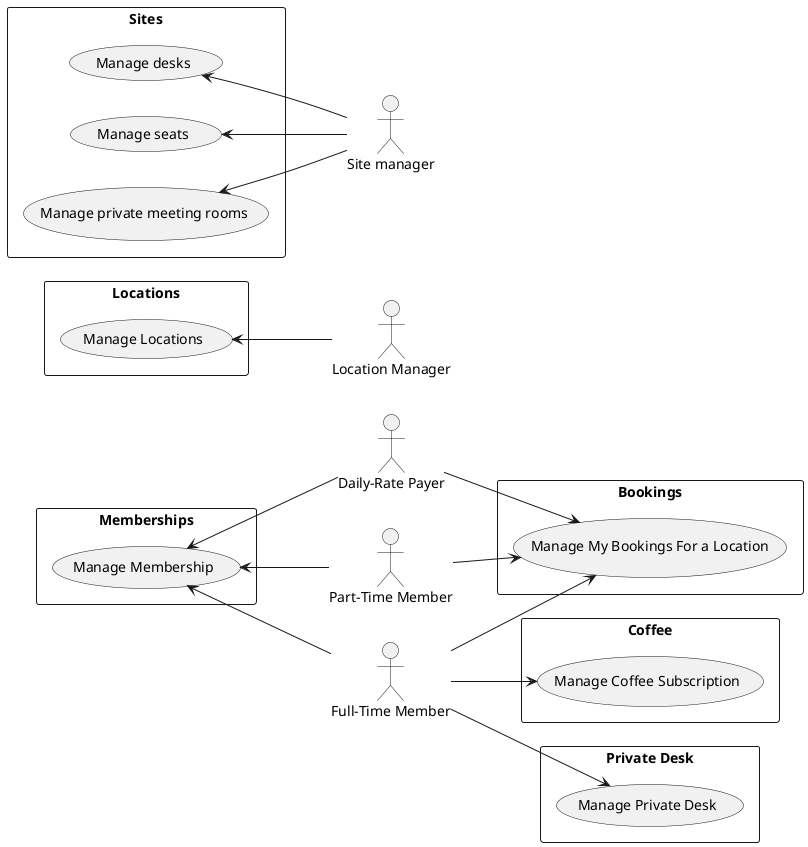

```plantuml
@startuml
left to right direction
actor "Daily-Rate Payer" as dr
actor "Part-Time Member" as pt
actor "Full-Time Member" as ft

rectangle Memberships {
  usecase "Manage Membership" as manageMembership
    manageMembership <-- dr
    manageMembership	<-- pt
    manageMembership <-- ft
}

rectangle Bookings {
  usecase "Manage My Bookings For a Location" as manageBookings
}

rectangle Coffee {
  usecase "Manage Coffee Subscription" as manageCoffeeSubscription
}

rectangle "Private Desk" {
  usecase "Manage Private Desk" as managePrivateDesk
}

pt --> manageBookings
ft --> manageBookings
dr --> manageBookings
ft --> manageCoffeeSubscription
ft --> managePrivateDesk

actor "Location Manager" as locationManager

rectangle Locations {
  usecase "Manage Locations" as manageLocations
  manageLocations <-- locationManager
}

actor "Site manager" as siteManager

rectangle Sites {
  usecase "Manage desks" as manageDesks
  usecase "Manage seats" as manageSeats
  usecase "Manage private meeting rooms" as manageRooms
  manageDesks <-- siteManager
  manageSeats <-- siteManager
  manageRooms <-- siteManager
}

@enduml
```
